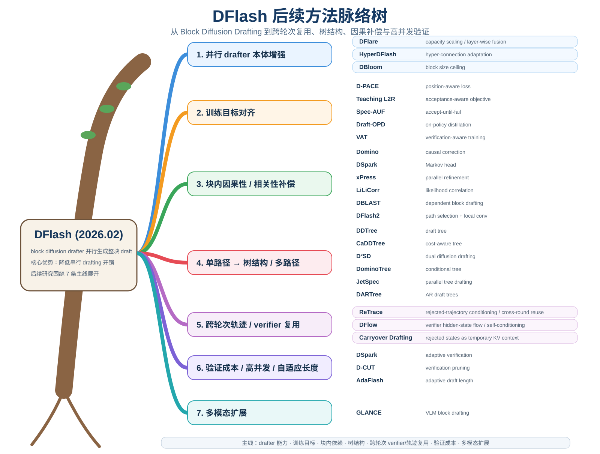

# Awesome Parallel Speculative Decoding

  

持续跟踪 **Parallel Speculative Decoding / DFlash / Block Diffusion Drafting**，并补充 **Diffusion Model Cache / Training-Free Acceleration** 方向。

核心参考：

> **DFlash: Block Diffusion for Flash Speculative Decoding** — arXiv:2602.06036

首页固定按以下顺序维护：

1. **DFlash 后续方法脉络树**：放在最开头，持续按研究主线更新。
2. **DFlash 后续论文时间线**：持续补充引用或直接延伸 DFlash 的工作。
3. **Daily Briefs**：每天筛选 5 条最值得关注的新论文 / GitHub / 框架 / 技术动态，最新日期在最前。

---

# DFlash 后续论文时间线

| 时间 | Paper | 简单摘要 | 核心动机 | 怎么解决 |
|---|---|---|---|---|
| **2026-04-14** | **DDTree — Accelerating Speculative Decoding with Block Diffusion Draft Trees** | ⭐ 把 DFlash 从“一条路径”变成“候选树” | 单路径浪费各位置 top-k 候选 | 从 DFlash 各位置 top-k 分布构建 **draft tree**，best-first 搜索后一次性验证整棵树。([arXiv](https://arxiv.org/abs/2604.12989)) |
| **2026-05-12** | **D-PACE — Dynamic Position-Aware Cross-Entropy for Parallel Speculative Drafting** | 改 DFlash 的训练 loss | 固定位置权重与真实 first-rejection 位置不一致 | 用 expected accepted length 的可微 surrogate 动态调整各位置 loss 权重。([arXiv](https://arxiv.org/abs/2605.18810)) |
| **2026-05** | **Test-Time Speculation** | 解决长回答下 acceptance 衰减 | 长生成后出现 distribution shift | 推理过程中做 **test-time / online distillation**。([alphaXiv](https://www.alphaxiv.org/abs/2605.09329)) |
| **2026-05-28** | **Draft-OPD — On-Policy Distillation for Speculative Draft Models** | ⭐ 用 on-policy 数据训练 drafter | SFT teacher trajectory 与真实 rollout 状态不一致 | 从真实 rollout 的 accepted/rejected token 构造训练信号，做 **on-policy distillation**。([arXiv](https://arxiv.org/abs/2605.29343)) |
| **2026-05-28** | **Domino — Decoupling Causal Modeling from Autoregressive Drafting** | ⭐ 给并行 DFlash 补回因果依赖 | block 内 token 基本独立 | 增加轻量 **causal / prefix-dependent head**。([arXiv](https://arxiv.org/abs/2605.29707)) |
| **2026-06-01** | **CaDDTree — Cost-Aware Diffusion Draft Trees** | DDTree 的系统版升级 | tree 越大 acceptance 越高，但 verifier 也越贵 | 联合优化 **接受收益 + verification latency**，动态选 tree size。([arXiv](https://arxiv.org/abs/2606.01813)) |
| **2026-06-01** | **DFlare — Scaling Up Draft Capacity for Block Diffusion Speculative Decoding** | ⭐ 直接增强 drafter 能力 | DFlash drafter 深度继续扩大后收益受限 | 用 **layer-wise target feature fusion** + 更多训练数据突破 scaling ceiling。([arXiv](https://arxiv.org/abs/2606.02091)) |
| **2026-06-03** | **D²SD — Dual Diffusion Draft Models** | 两级 diffusion drafter | 主路径早期失败后后续预测大量浪费 | 第二个 diffusion drafter 在潜在失败位置生成 alternative continuation，再组成共享前缀树。([alphaXiv](https://www.alphaxiv.org/abs/2606.04446)) |
| **2026-06** | **TreeFlash — Parallel AR-Approximation for Faster Speculative Decoding** | 并行逼近 AR dependency | DFlash 独立位置预测缺因果性 | 用轻量结构近似 autoregressive conditioning。([alphaXiv](https://www.alphaxiv.org/abs/2606.03819v1)) |
| **2026-06-05** | **WhiFlash — Token-Level Cross-Paradigm Routing** | AR / diffusion drafter 动态切换 | 不同 token 更适合不同 drafting 范式 | controller 动态选择 AR 或 diffusion drafting。([arXiv](https://arxiv.org/abs/2606.07710)) |
| **2026-06-11 左右** | **Teaching Diffusion to Speculate Left-to-Right** | 让训练目标和 verifier 行为一致 | verifier 只关心 first-error 前 prefix | 对前部 token、first-error 附近和连续正确链特殊 weighting/reward。([alphaXiv](https://www.alphaxiv.org/abs/2606.11552)) |
| **2026-06-25** | **JetSpec — Breaking the Scaling Ceiling of Speculative Decoding with Parallel Tree Drafting** | ⭐⭐⭐ 并行地产生“有因果关系的树” | DFlash 快但缺 causality；传统 tree 有 causality 但路径生成慢 | 用 target hidden state + **causal parallel draft head** 一次性给大量 tree branches 打分。([Project](https://jetspec-project.github.io/jetspec-web/)) |
| **2026-06-29** | **HyperDFlash** | 适配 Hyper-Connection 模型 | 新架构 hidden representation 与普通 Transformer 不同 | 用 HC-aware gated residual reduction 转换 target hidden states。([alphaXiv](https://www.alphaxiv.org/abs/2606.26744)) |
| **2026-07-02** | **Spec-AUF — Accept-Until-Fail Training** | ⭐ 极简单但合理的 loss 修改 | first fail 后 token 不会被接受，却仍参与 CE | **loss 只计算到 first fail**。([arXiv](https://arxiv.org/abs/2607.01893)) |
| **2026-07-06** | **DSpark — Confidence-Scheduled Speculative Decoding with Semi-Autoregressive Generation** | ⭐⭐⭐ DFlash 重要直接改进 | ① block 内缺依赖；②固定验证整块浪费 | **low-rank Markov Head + confidence head**，兼顾因果补偿和 adaptive verification。([GitHub](https://github.com/vllm-project/speculators/blob/main/docs/user_guide/algorithms/dspark.md)) |
| **2026-07-08** | **DeLS-Spec — Decoupled Long-Short Contexts** | 不重训 DFlash 的因果增强 | Domino/DSpark 等整体重训成本高 | 冻结 DFlash，只训练轻量 local short-context head 并做 logits 融合。([arXiv](https://arxiv.org/abs/2607.07409)) |
| **2026-07-09** | **DominoTree** | Domino + DDTree | DDTree 建树仍近似位置独立 | 用 Domino 的 path-conditioned score 做 best-first tree construction。([arXiv](https://arxiv.org/abs/2607.08642)) |
| **2026-07-16** | **D-CUT — Adaptive Verification Depth Pruning for Batched Speculative Decoding** | ⭐⭐⭐ 高并发重点工作 | 高并发时 verifier 走向 compute-bound，固定长 block 产生验证浪费 | 给 batch 一个 **global verification budget**，结合 confidence 与 runtime cost 动态裁剪 verification depth。([arXiv](https://arxiv.org/abs/2607.14647)) |
| **2026-07-21** | **AdaFlash — Adaptive Speculative Decoding via On-Policy Distilled Diffusion Drafters** | ⭐⭐⭐ OPD + adaptive DFlash | 最佳 draft length 随 domain / request / token 状态变化 | **reverse-KL on-policy distillation + adaptive length head**。([arXiv](https://arxiv.org/abs/2607.19223)) |
| **2026-07/08** | **Speculative Correction — Draft-then-Refine Decoding for Diffusion LMs** | 相邻路线 | diffusion LM 的双向上下文能力未充分利用 | 先生成整段 draft，再做 bidirectional diffusion refinement。([arXiv](https://arxiv.org/abs/2608.02625)) |
| **2026-08-03** | **xPress — Parallel Refinement for Diffusion Drafters** | ⭐⭐⭐ 解决独立预测问题 | 各位置 top-1 单独合理，但组合起来不一定 coherent | 用轻量 **parallel causal refiner** 一次性修正整个 block。([alphaXiv](https://www.alphaxiv.org/abs/2608.02438)) |
| **2026-08-05** | **DBLAST — Dependent Block Drafting for Stochastic Speculative Decoding** | 让 block token 显式相关 | stochastic sampling 下独立 marginals 容易组成低联合概率序列 | 引入 block-level **categorical latent variable**。([ResearchGate](https://www.researchgate.net/publication/411824644_DBLAST_Dependent_Block_Drafting_for_Stochastic_Speculative_Decoding)) |
| **2026-08-13** | **DARTree — Speculative Diffusion Decoding with Autoregressive Draft Trees** | ⭐⭐⭐ 当前非常重要 | diffusion tree 缺路径条件 | 把 AR correction head 从 chain 推广到 **candidate tree**，批量扩展 path 后 best-first pruning。([arXiv](https://arxiv.org/abs/2608.13524)) |
| **2026-08-18** | **DFlash 2 — Keep Drafting Parallel** | ⭐⭐⭐ 工程上很值得跟 | 正确 token 常在 top-k，但组合路径选错 | **candidate/path selection + lightweight local convolution**。([Hugging Face](https://huggingface.co/wyattearp/Qwen3.8-27B-DFlash2)) |
| **2026-08-20** | **LiLiCorr — Lightweight Likelihood Correlation of Parallel Drafts** | ⭐⭐⭐ 与 DFlash2/xPress 同一核心问题 | marginal logits 不表达候选组合是否合理 | 计算轻量 **adjacent compatibility / cosine score** 后选 joint path。([arXiv](https://arxiv.org/abs/2608.20530)) |
| **2026-08-30** | **ReTrace — Rejected-Trajectory Conditioning for Speculative Decoding** | ⭐⭐⭐ 把被拒绝的 suffix 从“废计算”变成下一轮条件信息 | 标准 prefix verification 在 first rejection 后直接丢掉后续 draft suffix，但这些 hidden states 仍保留与 target continuation 对齐的语义/结构信息 | 保留 first-rejection 之后的 rejected hidden trajectory，**对齐到下一轮 block → 用同一次 verification 得到的 target states 做 target-aware correction → gated residual fusion 注入下一轮 drafter 输入**；不额外增加 target/drafter forward，verification 规则不变，因此保持 lossless。([arXiv](https://arxiv.org/abs/2608.29748)) |
| **2026-08-31** | **Verification-Aware Training (VAT)** | ⭐ 从 verifier 反过来训练 drafter | CE accuracy 不等于 speculative acceptance | verification head 学 survive/reject pattern，并对 first-rejection 周围动态重加权。([arXiv](https://arxiv.org/abs/2608.30135)) |
| **2026-08-31** | **Ceiling-Clipped Acceptance Histograms / DBloom** | 研究 block size ceiling | 频繁 full-accept 时固定 block=16 变成 ceiling | 用 full-acceptance histogram 判断 ceiling，再扩展 block horizon。([arXiv](https://arxiv.org/abs/2608.30427)) |
| **2026-09-01 左右** | **GLANCE — Vision Is Not Overhead** | ⭐⭐⭐ DFlash 思想进入 VLM | 多模态 drafter 忽略/压缩视觉信息会降低 acceptance | 读取 target 已算好的 **fused vision-language hidden states** 做 one-pass block drafting，再构造 wide candidate tree 验证。([arXiv](https://arxiv.org/abs/2609.00355)) |

### ReTrace 为什么值得单独成一条主线

ReTrace 不是在“本轮”继续增强 path selection、causal correction 或 verification pruning，而是首次明确利用 **上一轮 rejected trajectory** 做 **cross-round conditioning**。论文报告相对 DFlash，四组 model × temperature 配置的宏平均 **acceptance length +6.97%**、**speedup +5.34%**；而且作者明确指出它与现有 drafting improvements 基本正交，可以继续和 DFlash2 / DSpark / DARTree 等组合。

---

# Daily Briefs

## 2026-09-09

> 今日重点：DFlash / DFlash2 工程与系统侧的实际瓶颈。若当天没有足够可信的新论文，不为了凑数重复旧论文。

| 时间 | 动态 | 1句摘要 | 核心动机 | 怎么解决 / 启示 | 与 DFlash 关系 |
|---|---|---|---|---|---|
| 2026-09-04 | **SGLang：DFlash2 thinking 模式 lossless 一致性问题** | thinking 后 greedy 输出可能与 target-only 分叉 | lossless correctness 比 acceptance 更优先 | 检查 candidate selector、verification mask 与特殊 token 路径 | ⭐⭐⭐ |
| 2026-09-02 | **SGLang：DFlash verification mask 显存增长问题** | `custom_mask` 可能随 batch 增长持续扩容 | 高并发 verification-side memory management 会成为瓶颈 | 按实际 batch shape 重建/裁剪 buffer 或复用 workspace | ⭐⭐⭐ |
| 2026-09-01 | **vLLM：DFlash2 超长上下文可能从加速变减速** | 长 context 下 drafter 历史状态处理吞掉收益 | speculative budget 还依赖 context length | 做 sequence-length-aware speculation controller | ⭐⭐⭐ |
| 2026-09-02 | **llama.cpp：特定 runtime / compiler 路径异常变慢** | 系统同步开销可能掩盖算法收益 | 加速越来越依赖 runtime/scheduler | benchmark 纳入 backend / compiler / sync path | ⭐⭐ |
| 近期 | **DFlash 生态扩大后端与模型覆盖** | DFlash 正从论文走向通用基础设施 | 单模型单并发 acceptance 不足以描述真实价值 | 建议评测 backend × batch × context × architecture | ⭐⭐ |

### 今日研究提示

1. **Context-aware DFlash**：`batch size + context length + confidence -> dynamic draft / verify length`。
2. **DFlash2 correctness**：优先验证 lossless guarantee，再看 accepted length / speedup。

---

## Daily archive

后续每天的简报会继续追加在这里，并同步单独归档到 `daily/YYYY-MM-DD.md`。
