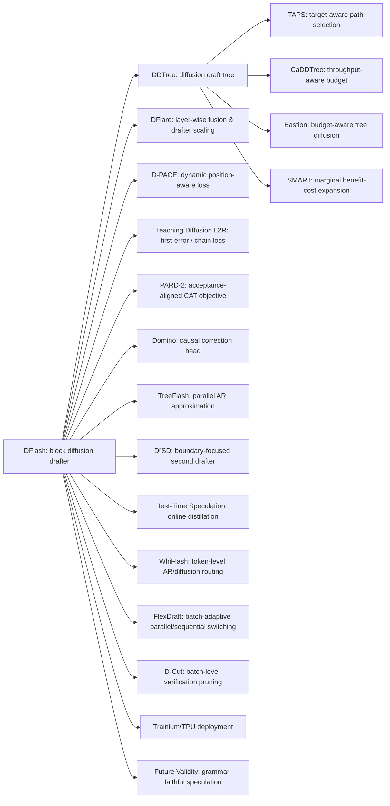

# DFlash 系列扩散式投机解码方法深度调研（合并新增论文版）

> 合并范围：本报告在旧版《DFlash 系列扩散式投机解码方法深度调研》的基础上，保留 DFlash、DDTree、TAPS、Domino、DFlare、CaDDTree、D²SD、D-Cut 等原有分析，并系统合入新增文章：D-PACE、Bastion、WhiFlash、Teaching Diffusion to Speculate Left-to-Right、TreeFlash、Test-Time Speculation、PARD-2、SMART、FlexDraft、Trainium/TPU 系统优化、Future Validity 等。

---

## 1. 执行摘要

把 DFlash、DDTree、TAPS、Domino、DFlare、CaDDTree、D²SD 以及新增的 D-PACE、Bastion、WhiFlash、Teaching Diffusion to L2R、TreeFlash、Test-Time Speculation、PARD-2、SMART、FlexDraft、Future Validity 放在一起看，可以发现这条技术线已经不只是“用 diffusion 做 speculative decoding”的单点创新，而是快速演化成了一个围绕 **并行起草、因果补偿、树状验证、预算优化、在线适配、语法保真与硬件部署** 展开的完整技术谱系。

旧版报告的核心判断仍然成立：DFlash 的真正突破不是简单“用了 diffusion”，而是把 **target-conditioned feature injection** 与 **block-parallel diffusion drafting** 组合成功，使 drafting 不再随候选长度线性增长，从而把主要瓶颈从“草稿生成”推向“验证预算与接受路径选择”。DDTree、TAPS、CaDDTree、D-Cut 本质上都在回答同一个问题：当 DFlash 一次给出一整块未来 token 分布后，应该如何把这些边际信息组织成更值得验证的树，并在吞吐最优的位置停止扩展。

新增论文进一步说明，DFlash/DDTree 之后的瓶颈已经明显分层：

1. **训练目标不匹配**：DFlash 类 block diffusion drafter 在训练时往往优化每个位置的 token prediction，而验证时真正关心的是“从左到右连续接受前缀”。D-PACE、Teaching Diffusion to L2R、PARD-2 都在修正这个目标错位。
2. **边际分布缺少因果条件**：DFlash/DDTree 的 per-position marginals 对树中不同分支共享同一后续分布，越往深处越偏离 target 的 autoregressive 条件分布。Domino 与 TreeFlash 都试图以轻量方式找回部分 causal dependency。
3. **树越大不等于越快**：DDTree 提高 acceptance length，但验证开销可能吞掉收益。TAPS、CaDDTree、Bastion、SMART 都把“是否扩展节点”改写成 path reachability、hardware cost 与 marginal utility 的联合问题。
4. **单一 drafter 范式不够灵活**：AR drafter 擅长开放式、局部因果强的生成；diffusion drafter 擅长结构化、低熵、多 token 并行场景。WhiFlash 与 FlexDraft 开始把“选择哪种 drafter/哪种执行模式”变成 token-level 或 batch-level 的动态路由问题。
5. **长文本与分布外推理会拖垮接受长度**：Test-Time Speculation 指出，很多 speculator 在几千 token 后 acceptance length 会退化接近 1，因此需要利用验证阶段已经产生的 target 信号做在线适配。
6. **约束生成中的分布保真被低估**：Future Validity 指出，在 grammar-constrained speculative decoding 中，仅靠 local mask 和 rollback 并不一定采样到用户期望的 grammar-conditional distribution，需要引入 future-validity statistic Φ 进行校正。
7. **硬件平台开始成为方法设计的一部分**：Trainium、TPU、H20/B200/A800 等系统实践表明，speculative decoding 的真实收益不仅由 acceptance length 决定，还由 KV cache、tree attention、batching、roofline、设备内存带宽与 kernel 实现共同决定。

因此，若目标是继续改进 DFlash/DDTree，新的优先级应该从旧版的“DDTree + TAPS + CaDDTree”升级为：

**第一优先级：DDTree/TAPS 选择器 + Bastion/SMART/CaDDTree 预算控制。** 这是最容易复用现有 DFlash/DDTree 代码、也最容易拿到端到端吞吐收益的方向。

**第二优先级：D-PACE / Teaching L2R / PARD-2 式训练目标重加权。** 它们不改变推理图，却能让 drafter 更直接优化 acceptance length，是低侵入、高性价比的训练侧增强。

**第三优先级：TreeFlash / Domino 式轻量因果补偿。** 这一方向直接解决 diffusion drafter 的非自回归弱点，但会增加模型结构和训练复杂度。

**第四优先级：WhiFlash / FlexDraft 式动态路由。** 这更像下一代系统型论文路线：不是证明某一种 drafter 永远更好，而是让系统在不同 token、不同 batch、不同任务阶段动态选择执行范式。

**第五优先级：Test-Time Speculation 与 Future Validity。** 前者面向长文本在线适配，后者面向约束生成分布保真；它们不是最容易在 DDTree 基线上短期落地的方向，但很有论文新意。

---

## 2. 技术谱系与瓶颈迁移

### 2.1 原始演化链：从并行起草到树状验证

DFlash 首先把 speculative decoding 的 drafting 阶段从 autoregressive drafter 的串行 token 生成中解放出来。它通过 block diffusion drafter 一次预测未来一整块 token，并把 target model 的 hidden feature 作为持续条件注入 drafter，使得草稿生成具有足够质量。这个阶段的核心瓶颈是：如何在不牺牲 target 分布一致性的前提下，用更便宜的 drafter 产生更长候选。

DDTree 发现，DFlash 一次 diffusion pass 实际给出了每个未来位置的边际分布，若只取 greedy 单路径，就浪费了大量候选信息。因此 DDTree 把这些边际分布组织成 prefix-closed tree，并通过 tree attention 一次性验证多个候选分支。DDTree 的最大意义不是“树更大”，而是把 DFlash 从 single trajectory speculation 推到了 tree-based diffusion speculation。

TAPS 进一步指出，DDTree 的问题在于 selection 仍然 path-unaware：一个节点边际概率高，不代表它在 target 左到右验证中真的可达。TAPS 引入 target-aware scorer，把每个候选从边际置信度转成 path-conditioned reachability，再结合 verification cost 做 dynamic pruning。

CaDDTree、Bastion、SMART 则共同把问题推进到 throughput objective：接受长度随预算增加通常单调上升，但真实速度不是。树扩得越大，verification latency、tree attention 开销、batch interference 都会增长，因此必须把“扩不扩展”变成 marginal benefit / marginal cost 判断。

### 2.2 新增论文带来的谱系扩展

这张新谱系图说明，DFlash 后续工作已经分成六条主线：

| 主线 | 代表方法 | 核心问题 | 最大变化 |
|---|---|---|---|
| 并行 drafter 底座 | DFlash、DFlare | 如何让 block diffusion drafter 足够强 | 从单一融合表征到 layer-wise fusion 与容量扩展 |
| 训练目标对齐 | D-PACE、Teaching L2R、PARD-2 | token CE 不等于 acceptance length | 从 token accuracy 转向 prefix acceptance objective |
| 因果补偿 | Domino、TreeFlash | 并行预测缺少 block 内因果依赖 | 用轻量 head/MLP 近似 AR 条件分布 |
| 树状验证与预算 | DDTree、TAPS、CaDDTree、Bastion、SMART、D-Cut | 树怎么构、怎么剪、何时停 | 从固定预算树转向 path/hardware/throughput-aware tree |
| 动态路由与在线适配 | WhiFlash、FlexDraft、Test-Time Speculation、D²SD | 单一 drafter 或固定策略不适合所有阶段 | token-level、batch-level、test-time 动态调整 |
| 分布保真与系统落地 | Future Validity、Trainium/TPU | 约束生成与硬件栈中的真实收益 | 从算法指标转向约束分布与服务吞吐 |

---

## 3. 逐篇方法分析

### 3.1 DFlash

DFlash 的架构核心是轻量级 block diffusion drafter。它不再逐 token 自回归生成草稿，而是一次 forward 并行预测整块未来 token，使 drafting latency 从近似随候选长度线性增长，转为单次并行前向的近似常数开销。更关键的是，它把 target model 的 hidden features 作为 persistent contextual information 注入 drafter 各层，使 diffusion drafter 不只是一个独立小模型，而是一个持续被 target 知识条件化的近似器。

DFlash 的最大改进点是：**第一次把 target-conditioned feature injection 与 block-parallel drafting 组合到足以改变瓶颈结构**。在 DFlash 之前，speculative decoding 的主要问题是 drafter 太慢或太弱；DFlash 之后，草稿生成变得足够便宜，verification、tree selection 和 budget allocation 反而成为新的主瓶颈。

对后续研究的启发：DFlash 是底座，不是终点。只要你继续沿这个方向做，核心问题就不再是“能不能一次并行预测多个 token”，而是“这些并行预测如何更像 target 的左到右条件分布，以及如何以最低验证成本利用它们”。

### 3.2 DDTree

DDTree 建立在 DFlash 之上。DFlash 一次 diffusion pass 输出每个未来位置的边际分布，vanilla DFlash 只把这些分布压成一条单路径草稿；DDTree 则把它们组织成 prefix-closed tree，在给定节点预算下用 best-first heap 选出更可能被 target 接受的候选分支，然后用 tree attention 一次性验证。

DDTree 的最大改进点是：**把 DFlash 单次 diffusion pass 的边际信息释放成可验证的树**。它证明 block diffusion drafter 不应该只服务于一条 trajectory，而可以天然服务于 tree-based speculative decoding。

但 DDTree 也暴露了后续瓶颈：固定预算下最大化 expected acceptance length 并不等于最大化 throughput。树越大，接受长度通常越长，但验证开销也越高，速度可能先升后降。

### 3.3 TAPS

TAPS 直接修补 DDTree 的 path-unaware selection 问题。DDTree 根据边际概率选节点，但 target 验证是 prefix-conditioned 的：只有祖先节点都被接受，后代才有意义。TAPS 因此引入 target-aware scorer，把候选节点的边际置信度转化成 path-conditioned reachability，再结合 verification cost 做 dynamic pruning。

TAPS 的最大改进点是：**第一次把 path reachability 和 verification cost 同时放进 tree selector**。它不再问“哪个 token 边际概率高”，而是问“这条路径真的会被 target 走到吗？验证它值不值？”

对你的 DDTree 改进最直接的启发是：不要只训练一个节点分数，而要训练一个“路径可达性 + 单位验证收益”的 scorer。你之前设想的 learnable scorer 可以沿 TAPS 的方向扩展，把 depth、rank、logprob、entropy、prefix score、ancestor confidence、position index 都作为特征。

### 3.4 CaDDTree

CaDDTree 把 DDTree 的目标函数从 acceptance length 改成 token throughput。它显式建模 drafting cost 与 verification cost，并证明在一定 convex verification cost 条件下，throughput 对树大小呈单峰，因此可以在运行时用 greedy stopping 找到接近最优的预算。

CaDDTree 的最大改进点是：**把 DDTree 从 acceptance-optimal 改成 throughput-optimal**。这解决了一个非常实际的问题：不同模型、硬件、上下文长度、batch size 下，最优 tree budget 不一样，离线固定预算很难稳定最优。

对后续研究的启发：若你要改 DDTree，budget 不应该是一个固定超参，而应该是每轮由当前分布和硬件 cost model 决定的动态变量。

### 3.5 Bastion

Bastion 与 CaDDTree 在问题意识上高度接近，但它更强调 **budget-aware tree-structured block diffusion drafting** 的完整框架。它包含三个组件：基于 path confidence 的 acceptance surrogate、结合 roofline 的在线 latency estimator，以及按 marginal gain / marginal cost 动态停止的 best-first expansion。

Bastion 的最大改进点是：**把树扩展过程做成 query-dependent、hardware-aware、training-free 的动态决策**。相较于 DDTree 的固定节点预算，Bastion 不需要为每个设置离线调参，也不只是追求更长接受长度，而是直接在当前 query 和当前硬件条件下决定树该扩多大。

Bastion 与 CaDDTree/TAPS 的关系可以这样理解：TAPS 强调 path-aware selection，CaDDTree 强调 throughput objective，Bastion 则试图把 path confidence、hardware roofline 和 adaptive expansion 放进一个统一框架。若要做一个实用版 DDTree 改进，Bastion 的工程启发非常强。

### 3.6 SMART

SMART 针对更一般的 tree-based speculative decoding 提出 system-aware marginal analysis。它指出很多树状方法存在 efficiency paradox：树越大，接受 token 可能越多，但 drafting 和 verifying 的成本可能超线性增长，尤其在 batch size 增大或硬件接近饱和时，可能出现负加速。

SMART 的最大改进点是：**把“是否扩展一个节点”改写为边际收益/边际成本是否超过当前树级 speedup 的判断**。这使它可以作为现有 tree speculative methods 的 plug-in controller。

SMART 对 DFlash/DDTree 的启发在于：即使你的 tree selector 很聪明，也不能只在算法层面估计 token gain，还必须把 GPU kernel、batching、memory bandwidth、tree attention shape 都纳入成本判断。SMART 与 Bastion/CaDDTree 可以被看作同一类思想在不同系统粒度上的表达。

### 3.7 D-Cut

D-Cut 更偏系统优化。它关注 DFlash 在高 batch serving 中 verification cost 暴涨的问题，通过硬件驱动的 cost model 和跨请求 top-K 分配，减少无意义的 verification token。

D-Cut 的最大改进点是：**把 budget allocation 从单请求内部扩展到 batch-level / serving-level**。这说明 DFlash 家族真正落地时，不能只看单请求 speedup，还要看 batch serving 下不同请求之间如何共享验证预算。

### 3.8 Domino

Domino 的问题意识是：block diffusion drafter 并行起草很快，但牺牲了 block 内 token 的 causal dependency；AR drafter 有这种依赖，但又会回到 O(K) 串行开销。Domino 因此在 parallel draft backbone 之上叠加轻量 causal encoder + low-rank correction head，对 base logits 做 prefix-dependent residual correction。

Domino 的最大改进点是：**把 causal modeling 从 autoregressive execution 中拆出来**。它证明，要补回 prefix dependency，不一定要重新支付完整 AR drafting 的串行成本。

对 DFlash/DDTree 的启发：你可以在 diffusion drafter 输出后增加一个非常轻量的 causal correction 模块，让同一个位置的分布不再只依赖 prefix context 和 position，而能感知已经起草的前序 token。这个方向和 TreeFlash 更接近，适合解决“越往后 acceptance 快速下降”的问题。

### 3.9 TreeFlash

TreeFlash 直接针对 one-shot block drafter 的非自回归缺陷。它指出，DFlash 类方法在每个未来位置预测 token 时只依赖原始 prefix，不依赖先前已草拟 token；在树状 drafting 中，这个问题更严重，因为不同分支会共享同一套后续边际分布。

TreeFlash 的做法是在 drafter hidden state 和 previous token 条件下加入轻量 MLP，用两阶段近似机制模拟 AR 条件分布，同时保持 one-shot drafter 的 O(1) 解码时间复杂度。

TreeFlash 的最大改进点是：**用轻量 parallel AR approximation 修补 diffusion/tree drafter 的 branch-conditional distribution 缺失**。它与 Domino 的共同点是“补因果”，区别是 TreeFlash 更直接面向 tree/block marginal distribution，而 Domino 更像 parallel backbone 后的 correction head。

对你的研究而言，TreeFlash 很值得重点关注。因为你之前想把 draft 从独立概率变成“给定路径下子节点概率”，TreeFlash 正是在这个方向上给出了一个轻量实现思路：不是让每个路径都完整 AR 生成，而是用前一 token 与 hidden state 对边际分布做条件化修正。

### 3.10 DFlare

DFlare 是“把 DFlash 本身做强”的代表。它指出 DFlash 的瓶颈不只是 selector，而是所有 draft layers 共享一份较窄 target-fusion 表征，限制了 deeper drafter 和更多 target layers 的收益。DFlare 用 layer-wise fusion 让每一层 drafter 学自己的 target-layer 加权组合，同时扩大训练数据与 drafter capacity。

DFlare 的最大改进点是：**打破 DFlash 的共享窄融合瓶颈，使 drafter depth、target-layer count 与 data scale 能一起往上推**。

如果目标是改 DDTree，DFlare 不是第一步；但如果目标是改 DFlash 底座，DFlare 是最直接路线。更强 drafter 与更聪明 tree selector 是互补的。

### 3.11 D-PACE

D-PACE 聚焦训练目标。传统 multi-token drafter 常用固定 position weighting，例如越靠前 token 权重越大，或按 head/position 手工设权重。但真正限制 acceptance length 的位置会随着训练过程变化：早期可能第 1、2 个 token 最差，后期可能中后段位置成为瓶颈。

D-PACE 从 expected accepted draft length 的可微 surrogate 出发，动态计算每个位置的训练权重，使训练信号自动集中到当前最限制接受长度的位置。它不改变 drafter 架构，也不改变推理流程，只改变 loss。

D-PACE 的最大改进点是：**把位置权重从静态超参变成随训练状态变化的动态 acceptance-aware 权重**。

对 DFlash/DDTree 的启发：如果你要训练一个 DDTree scorer 或改 DFlash drafter，不要只对所有位置做均匀 CE，也不要只手工强调前几个位置；应该让 loss 根据“哪个位置最常导致 prefix break”自动调整。

### 3.12 Teaching Diffusion to Speculate Left-to-Right

这篇工作同样关注训练—验证错位，但视角更明确：diffusion drafter 在训练时对 block 内 token 做双向建模，而 target 验证是严格 left-to-right。任何早期错误都会截断后续 token，即使后面的 token 单独预测正确也没用。

文章提出三个训练干预：position-wise weighting、first-error focal loss、chain loss。三者分别从位置、首错位置、联合前缀接受概率三个维度缩小双向训练目标与左到右验证奖励之间的差距。

最大改进点是：**把 diffusion drafter 的训练目标显式改造成 left-to-right verification-aware objective**。

它与 D-PACE 的区别是：D-PACE 更偏动态位置权重，Teaching L2R 更系统地把 first-error 和 prefix-chain probability 纳入训练。二者可以组合：D-PACE 负责动态定位薄弱位置，first-error/chain loss 负责把连续前缀接受结构写进目标函数。

### 3.13 PARD-2

PARD-2 不是纯 DFlash 派生，但它对 speculative drafter 的训练目标有很强启发。它把优化目标从 token prediction accuracy 转向整体 acceptance length，并提出 Confidence-Adaptive Token weighting，使每个 token 的训练权重根据其对验证流程的影响自适应调整。同时，它希望一个 draft model 支持 target-dependent 和 target-independent 两种模式。

PARD-2 的最大改进点是：**把 drafter 训练对齐到 verification process，而不是只对齐 token-level likelihood**。

对 DFlash/DDTree 的启发是：你训练的不是一个普通 language model，而是一个被 verifier 消费的 proposal model。proposal 的好坏不能只看 top-1 accuracy 或 CE，而应该看它是否提高连续接受长度、是否降低 verifier 负担、是否能在不同 target 依赖模式下稳定工作。

### 3.14 WhiFlash

WhiFlash 认为，AR drafter 和 diffusion drafter 各有优势：AR 更适合开放式、强因果依赖、局部不确定性高的片段；diffusion 更适合结构化、低熵、可并行预测的片段。固定使用一种 drafter 会浪费互补性。

WhiFlash 因此提出 token-level cross-paradigm routing：在每个 token 或局部阶段动态选择 AR 或 diffusion drafter，并通过 Lazy Catch-up、KV-only Prefill 等缓存管理优化降低频繁切换的开销。

WhiFlash 的最大改进点是：**不再把 AR 与 diffusion 看成二选一，而是在 token 粒度做跨范式路由**。

这对未来 DFlash/DDTree 改进很重要：当你发现某些任务/位置 diffusion 很强，某些任务/位置 AR 更强时，不一定要训练一个万能 drafter；可以训练一个 router，让系统动态选择“当前应该相信谁”。

### 3.15 FlexDraft

FlexDraft 关注 batch size 变化下 parallel speculative decoding 的稳定性。并行 draft/verify 在小 batch 下可能很快，但大 batch 下会因为 bonus token 不确定、accepted length 不确定、中间状态交换和 memory access 开销导致吞吐崩塌。

FlexDraft 提出三部分设计：Attention Tuning，只微调最后几层 attention projector 来支持 block diffusion drafting；Bonus-guided Calibration，用轻量 MLP 根据 resolved bonus token 校准 draft logits；Flex Decoding，根据 batch size 和 draft confidence 在 parallel 与 sequential 模式之间动态切换。

FlexDraft 的最大改进点是：**把 speculative decoding 的执行范式从固定模式改成 batch-adaptive flexible mode**。

它与 WhiFlash 的关系是：WhiFlash 在 token 粒度选 AR/diffusion drafter，FlexDraft 在 batch/执行模式层面选 parallel/sequential 路径。二者共同说明，未来高性能 speculative decoding 不是一个固定算法，而是一个 runtime policy。

### 3.16 D²SD

D²SD 认为，DFlash 单阶段 block draft 常在某个较早位置发生 rejection，后缀全部浪费。与其盲目扩大第一阶段树，不如预测最可能的 rejection boundary，并在该位置附近用第二个 variable-prefix diffusion drafter 做 targeted recovery。

D²SD 的最大改进点是：**围绕 predicted rejection boundary 做二次定点恢复，而不是均匀扩宽第一阶段候选树**。

它对 DDTree 改进的启发是：tree budget 不应该均匀分布到所有深度和分支，而应该集中在最可能发生首错的位置附近。D²SD 的代价是系统复杂度高，需要第二个 drafter 和 shared-prefix cascade attention。

### 3.17 Test-Time Speculation

Test-Time Speculation 指出，很多 speculator 在长文本生成中 acceptance length 会随着生成长度增加而退化，甚至接近 1。原因是 drafter 离线训练通常覆盖较短上下文，而推理时需要在更长输出、更偏分布外的状态下匹配 target。

TTS 的关键思想是：验证阶段本来就会调用 target model，因此每一轮 verification 都天然产生了训练信号。把 drafter 当学生、target 当老师，就可以在 test time 连续在线更新 drafter，使其逐渐适应当前长文本上下文。

TTS 的最大改进点是：**把 speculative decoding 从静态 drafter 推向在线自适应 drafter**。

对 DFlash/DDTree 的启发是：如果目标任务是长回答、长代码、长推理链，那么仅靠离线训练的 drafter 可能不够。可以考虑只在线更新小规模 adapter、scorer 或 calibration head，而不是更新完整 drafter，以降低工程风险。

### 3.18 Future Validity

Future Validity 讨论 grammar-constrained speculative decoding 的分布保真问题。它证明，在 local vocabulary masking + Leviathan rejection + rollback soundness 的框架下，采样到的可能是 locally projected distribution，而不是用户真正想要的 grammar-conditional distribution。尤其在 Dyck grammar 等场景中，两者 total variation gap 可能非常大。

文章提出 future-validity function Φ(y)=Pr[valid completion | prefix y] 作为缺失的校正统计量。若有精确 Φ，可通过 Doob transform 形式恢复目标 grammar-conditional distribution；若只能近似 Φ，也可以给出误差界。

Future Validity 的最大改进点是：**指出约束生成中的“合法 token mask + speculative rollback”并不自动保证语法条件分布正确，需要未来可完成性统计量进行校正**。

这条线对 DFlash/DDTree 不是短期吞吐优化，但对 JSON、代码、工具调用、SQL 等 grammar-constrained 场景非常重要。如果未来把 DDTree 用在结构化输出里，不能只看 speedup，还要看约束分布是否被 speculative verification 改歪。

### 3.19 Trainium / TPU 系统优化

新增材料中的 Trainium 与 TPU 相关实践说明，speculative decoding 已经进入硬件系统栈。AWS Trainium + vLLM 展示了 speculative decoding 在专用 AI 芯片上的实际吞吐收益；Google TPU 上的 DFlash 集成说明 diffusion-style speculative decoding 可以被移植到非 NVIDIA GPU 的 serving 生态中。

这类工作的最大意义不是提出新算法，而是证明：**speculative decoding 的真实价值取决于算法—编译器—kernel—memory hierarchy—serving scheduler 的联合优化**。

对 DFlash/DDTree 改进的启发是：最终论文如果只报 Transformers backend 单请求 speedup 说服力会越来越弱。未来更有价值的实验应包括 vLLM/SGLang serving、batch scaling、不同硬件、不同上下文长度与真实吞吐曲线。

---

## 4. 横向对比表

| 方法 | 主要类型 | 解决的核心瓶颈 | 最大改进点 | 对 DFlash/DDTree 的启发 | 实现复杂度 | 优先级 |
|---|---|---|---|---|---|---|
| DFlash | block diffusion drafter | AR drafting 串行 | target-conditioned block-parallel drafting | 底座方法 | 高 | 基线 |
| DDTree | diffusion tree verification | 单路径浪费边际分布 | 把 DFlash marginals 组织成树 | 树状验证起点 | 中 | 基线 |
| TAPS | path-aware selector | DDTree path-unaware | reachability + cost-aware pruning | 训练路径可达性 scorer | 中 | P0 |
| CaDDTree | throughput-aware budget | acceptance 不等于 throughput | 动态预算选择 | 固定 B 改 runtime budget | 中 | P0 |
| Bastion | budget-aware tree diffusion | 静态树拓扑与硬件不匹配 | path confidence + roofline + adaptive expansion | 统一 path 与 hardware cost | 中 | P0 |
| SMART | system-aware tree expansion | 大树造成负加速 | marginal benefit/cost expansion rule | 节点扩展要看硬件边际收益 | 中 | P0 |
| D-Cut | batch-level pruning | 高 batch verification 开销 | 跨请求预算分配 | 面向 serving 的 tree/token allocator | 中 | P1 |
| DFlare | drafter scaling | DFlash 融合表征窄 | layer-wise fusion + 更深 drafter | 提高底座上限 | 高 | P1 |
| D-PACE | training objective | 静态位置权重不适应 | dynamic position-aware CE | loss 对齐 acceptance bottleneck | 低-中 | P1 |
| Teaching L2R | training objective | diffusion 双向训练 vs L2R 验证 | position/first-error/chain loss | 把首错位置写进训练目标 | 中 | P1 |
| PARD-2 | target-aligned drafter | token accuracy 不等于 acceptance | CAT confidence-adaptive weighting | 训练 proposal 而非普通 LM | 中 | P1 |
| Domino | causal correction | 并行 drafter 缺因果 | causal encoder + low-rank correction | 不回到 AR 也能补因果 | 高 | P2 |
| TreeFlash | parallel AR approximation | tree branch 共享边际后续分布 | previous-token conditioned MLP | 条件化子节点概率 | 中-高 | P2 |
| WhiFlash | cross-paradigm routing | 单一 drafter 不适合所有 token | token-level AR/diffusion routing | 做 router 而不是万能 drafter | 高 | P2/P3 |
| FlexDraft | adaptive execution | batch size 导致吞吐不稳 | attention tuning + bonus calibration + flex decoding | runtime 执行模式自适应 | 高 | P3 |
| D²SD | multi-stage recovery | 首错后后缀全浪费 | rejection boundary 二次恢复 | 预算集中到首错附近 | 高 | P3 |
| Test-Time Speculation | online adaptation | 长文本 acceptance 退化 | 用 verification 信号在线蒸馏 | 长文本场景可在线更新 adapter/scorer | 高 | P3 |
| Future Validity | constrained decoding theory | grammar mask 不保证条件分布 | Φ-estimation / Doob correction | 结构化输出要评估分布保真 | 高/理论 | 专项 |
| Trainium/TPU 优化 | system deployment | 硬件与 serving 栈影响真实收益 | 专用芯片/serving 集成 | 论文实验要从单请求走向系统吞吐 | 工程高 | 支撑 |

---

## 5. 对改进 DFlash/DDTree 的新研究建议

### 5.1 最建议优先做：DDTree + TAPS/Bastion/SMART/CaDDTree 的统一预算选择器

如果你的目标是尽快做出一个比 DDTree 更强、工程成本又可控的版本，最优先方向仍然是 selector 和 budget，而不是重训一个复杂 drafter。

可以把目标拆成三层：

1. **path-aware score**：学习或估计每个节点的 path-conditioned acceptance probability，而不是只用 per-position marginal probability。
2. **cost-aware utility**：给每个候选节点计算 expected accepted tokens / verification cost，而不是只看接受长度。
3. **runtime stopping**：每轮按 marginal gain / marginal cost 判断是否继续扩展，而不是固定 TREE_BUDGET。

一个可发表的组合形式可以是：

> **Throughput-Aware Target-Path Diffusion Draft Tree**：在 DDTree 上引入 TAPS 式 path reachability scorer、Bastion/SMART 式 marginal cost rule 和 CaDDTree 式 runtime budget search，实现无需离线 budget sweep 的吞吐最优 diffusion draft tree。

这条线的优点是：不改 DFlash drafter、不大幅增加训练成本、容易做 ablation、很适合你当前已经在 DDTree 上做 learnable scorer 的设想。

### 5.2 第二优先：把 D-PACE / Teaching L2R / PARD-2 融入 DFlash 训练

如果你愿意重训或微调 drafter，训练目标是最值得先改的地方。

可以组合三类 loss：

- **动态位置权重**：借鉴 D-PACE，让权重随当前 acceptance bottleneck 变化；
- **首错位置强化**：借鉴 Teaching L2R，对 first rejection position 施加额外损失；
- **连续前缀代理目标**：用 chain loss 或 expected accepted length surrogate，让 loss 不只看单点 token CE；
- **置信度自适应权重**：借鉴 PARD-2，根据 token confidence 或 target-draft discrepancy 调整训练权重。

这条线可以形成一个清晰贡献：

> **Acceptance-Aligned Training for Diffusion Draft Trees**：把 DFlash/DDTree 的训练目标从 position-wise token CE 改成 prefix-acceptance-aware objective，使 drafter 和 tree scorer 共同优化 verifier 真正关心的连续接受长度。

它的风险比重新设计架构小，而且与已有 DDTree selector 完全兼容。

### 5.3 第三优先：TreeFlash/DOMINO 式“条件概率 draft”

你之前提出“draft 从独立概率变成条件概率，训练出给定路径下子节点概率”，这个方向在新增论文里有非常明确的对应：TreeFlash 和 Domino。

一个可行实现是：

- 保留 DFlash 输出的 per-position logits 作为 base marginal；
- 对树中节点引入轻量 correction head，输入包括 previous token embedding、depth、parent hidden state、draft entropy、position embedding；
- 输出 residual logits 或 reweight score，用来近似 path-conditioned child distribution；
- 不做完整 AR drafting，保持一次 block pass + 轻量并行 correction。

这个方向的论文表述可以是：

> **Path-Conditioned Parallel Diffusion Drafting**：在 one-shot diffusion marginals 上增加轻量 branch-conditioned correction，使 DDTree 的子节点概率从 position marginal 变成 approximate autoregressive conditional distribution。

相比单纯训练 scorer，这条线新意更强；但它需要更多训练和系统验证。

### 5.4 第四优先：WhiFlash/FlexDraft 式动态路由

当你发现不同任务、不同位置、不同 batch 下 DFlash/DDTree 的收益不稳定时，可以考虑 runtime routing。

可做方向：

- token-level：根据 entropy、top-k gap、draft-target disagreement、position depth 选择 AR drafter 或 diffusion drafter；
- branch-level：对高置信度分支用 diffusion tree，对低置信度分支用 AR correction；
- batch-level：小 batch 用 parallel draft/verify，大 batch 用 sequential draft + shorter verification 或 D-Cut 式裁剪；
- hardware-level：根据 GPU occupancy、KV cache 压力和 tree attention cost 动态调整策略。

这条线更像系统论文，实验要包含 serving throughput 和 batch scaling，而不能只报单请求 acceptance length。

### 5.5 第五优先：Test-Time Speculation 与长文本自适应

如果你的应用场景有长回答、长代码、长推理链，TTS 很值得跟进。可以不直接在线更新完整 drafter，而是选择更轻量的参数：

- 在线更新 scorer；
- 在线更新 calibration head；
- 在线更新 LoRA/adapter；
- 在线维护 rejection memory 或 prefix-specific statistics；
- 对长上下文后半段启用更保守 budget 或更强 correction。

这条线的核心是解决“speculator 随生成长度退化”的问题。它不一定是 DDTree 最快能落地的改进，但很适合做长文本专项实验。

### 5.6 专项方向：Future Validity 与结构化输出

如果未来要把 speculative decoding 用在 JSON、SQL、代码补全、工具调用等约束生成中，Future Validity 提醒我们不能只看输出是否合法，还要看采样分布是否等于 grammar-conditional distribution。

可做方向：

- 在 DDTree 验证中加入 future-validity estimator；
- 对 tree nodes 不仅估计 token probability，还估计 valid completion probability；
- 对 JSON/SQL grammar 做有限状态或 trie-based Φ 估计；
- 评估 speedup、valid rate、distribution gap 三个指标，而不是只看 speedup。

这是理论与结构化生成结合的方向，短期不一定最容易，但差异化强。

---

## 6. 新版结论：如果要改 DFlash/DDTree，应该怎么排优先级？

综合旧版和新增论文，我建议新的研究优先级如下：

| 优先级 | 方向 | 为什么优先 | 预期收益 | 风险 |
|---|---|---|---|---|
| P0 | DDTree + TAPS/Bastion/SMART/CaDDTree | 不改 drafter，直接解决树预算浪费 | 最容易提升真实 throughput | 需要准确 cost model |
| P1 | D-PACE + Teaching L2R + PARD-2 训练目标 | 不改推理，直接优化 acceptance length | 性价比高，易 ablation | 需要重训/微调 drafter |
| P2 | TreeFlash/Domino 条件化修正 | 解决 diffusion 非因果本质问题 | 新意强，上限高 | 架构与训练更复杂 |
| P3 | WhiFlash/FlexDraft 动态路由 | 适配不同 token/task/batch/hardware | 系统收益高 | 工程复杂，实验重 |
| P4 | D²SD/TTS 二阶段或在线适配 | 解决首错浪费和长文本退化 | 特定场景强 | runtime 复杂度高 |
| 专项 | Future Validity | 解决约束生成分布正确性 | 差异化强 | 理论门槛高，场景窄 |

最现实的短期论文方案是：

> **方案 A：Throughput-Aware Path-Conditioned DDTree**  
> 在 DDTree 上合入 TAPS 的 path-aware reachability、Bastion/SMART 的边际收益成本判断、CaDDTree 的 runtime budget selection。目标是证明：在同样 DFlash drafter 下，新的 selector 能同时提高 acceptance efficiency 和 wall-clock throughput，且无需离线 budget sweep。

如果你想进一步增强新意，可以做：

> **方案 B：Acceptance-Aligned Path-Conditioned Diffusion Drafter**  
> 训练阶段引入 D-PACE/Teaching L2R/PARD-2 式 loss，推理阶段引入 TreeFlash 式 lightweight conditional correction，使 DDTree 的节点分布从 position marginal 变成 approximate path-conditional distribution。

如果你想做更偏系统的方向，可以做：

> **方案 C：Adaptive Hybrid Speculative Decoding for DFlash Trees**  
> 结合 WhiFlash 的 token-level routing、FlexDraft 的 batch-adaptive mode switching 和 D-Cut/SMART 的 serving-level cost control，形成一个面向真实 serving 的动态 speculative decoding runtime。

我的建议是先做方案 A，因为它最贴近你现在的 DDTree 改进设想，成本最低、实验闭环最清楚；方案 B 作为第二篇或增强版；方案 C 适合后续走系统论文或工程落地。

---

## 7. 参考文献与入口

> 注：以下为本次合并涉及的主要论文/资料入口，建议后续写正式论文相关工作时再统一转换为 BibTeX。

- DFlash: Block Diffusion for Flash Speculative Decoding. arXiv:2602.06036. https://arxiv.org/abs/2602.06036
- DDTree / Accelerating Speculative Decoding with Block Diffusion Draft Trees. arXiv:2604.12989. https://arxiv.org/abs/2604.12989
- TAPS: Target-Aware Prefix Tree Selection for Diffusion-Drafted Speculative Decoding.
- Domino: Decoupling Causal Modeling from Autoregressive Drafting in Speculative Decoding.
- DFlare: Scaling Up Draft Capacity for Block Diffusion Speculative Decoding. arXiv:2606.02091. https://arxiv.org/abs/2606.02091
- CaDDTree: Cost-Aware Diffusion Draft Trees for Speculative Decoding. arXiv:2606.01813. https://arxiv.org/abs/2606.01813
- D²SD: Dual Diffusion Speculative Decoding.
- D-PACE: Dynamic Position-Aware Cross-Entropy for Parallel Speculative Drafting. arXiv:2605.18810. https://arxiv.org/abs/2605.18810
- Bastion: Budget-Aware Speculative Decoding with Tree-structured Block Diffusion Drafting. arXiv:2605.29727. https://arxiv.org/abs/2605.29727
- WhiFlash: Accelerating Speculative Decoding with Token-Level Cross-Paradigm Routing. arXiv:2606.07710. https://arxiv.org/abs/2606.07710
- Teaching Diffusion to Speculate Left-to-Right. arXiv:2606.11552. https://arxiv.org/abs/2606.11552
- TreeFlash: Parallel AR-Approximation for Faster Speculative Decoding. arXiv:2606.03819. https://arxiv.org/abs/2606.03819
- Test-Time Speculation. arXiv:2605.09329. https://arxiv.org/abs/2605.09329
- PARD-2: Target-Aligned Parallel Draft Model for Dual-Mode Speculative Decoding. arXiv:2605.08632. https://arxiv.org/abs/2605.08632
- SMART: When is it Actually Worth Expanding a Speculative Tree? arXiv:2604.09731. https://arxiv.org/abs/2604.09731
- FlexDraft: Flexible Speculative Decoding via Attention Tuning and Bonus-Guided Calibration. arXiv:2605.20022. https://arxiv.org/abs/2605.20022
- Future Validity is the Missing Statistic: From Impossibility to Φ-Estimation for Grammar-Faithful Speculative Decoding. arXiv:2605.07698. https://arxiv.org/abs/2605.07698
- AWS Trainium speculative decoding / vLLM deployment materials.
- Google TPU DFlash / diffusion-style speculative decoding deployment materials.
